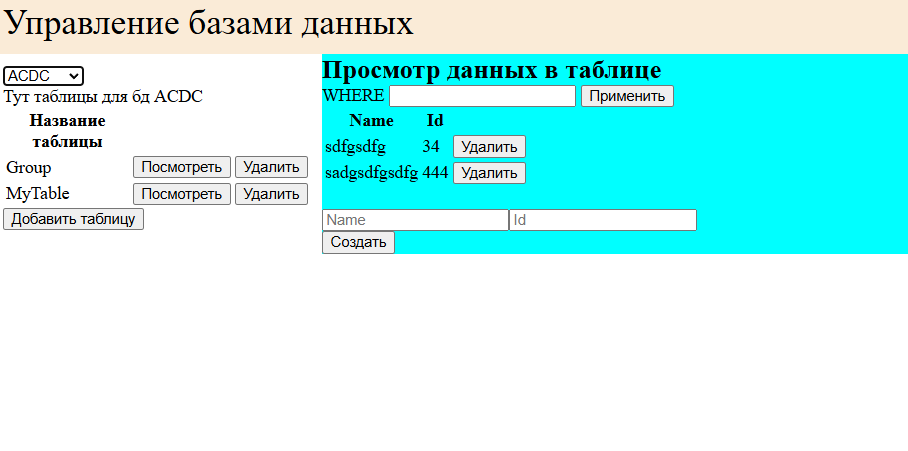
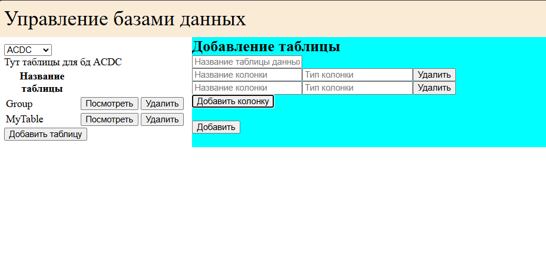

# Практическая работа №1 по предмету "Компьютерные методы в образовании, науке и производстве".

## Задание

Необходимо реализовать возможность через браузер создавать базы данных, выбирать базы 
данных, и выполнять основные функции для работы с таблицами для выбранной базы 
данных. Среди функций для работы с таблицами нужно реализовать возможности:  
- создания таблицы для выбранной базы данных; 
- внесение данных в таблицу; 
- поиск данных по значениям в ее столбцах; 
- удаление данных из таблицы; 
- вывод данных для просмотра в браузере в виде таблицы.  
Весь перечень возможных действий с таблицами нужно оформить в виде выпадающих 
списков и окошек для ввода данных. Все запросы отправляются на сервер с помощью 
технологии Ajax. В окне для ввода данных должно проигрываться видео, подтверждающее, 
что все сведения отправляются с помощью Ajax. Изначально на html-странице показан 
вопрос «Вы хотите создать базу данных или использовать уже созданную?» и выпадающий 
список, из двух пунктов. Пользователь выбирает один из пунктов и нажимает копку 
«выбрать». После этого без перезагрузки страницы с помощью технологии Ajax 
появляются другие выпадающие пункты, соответствующие выбору пользователя. 
Подобным образом с помощью технологии Ajax нужно сделать появление остальных 
выпадающих список или окошек для введения информации, а также вывод сведений, 
полученных со стороны сервера. 

## Как запустить

```
docker-compose -f docker-compose.yaml up -d
```

## Демонстрация




